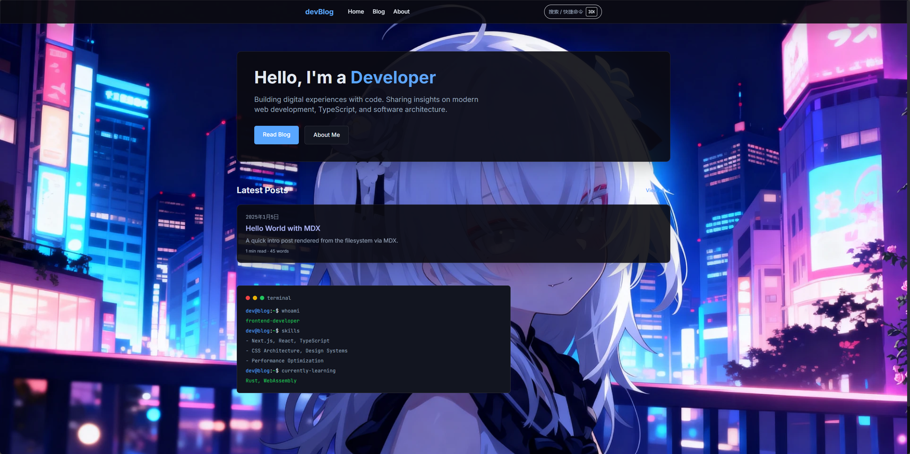
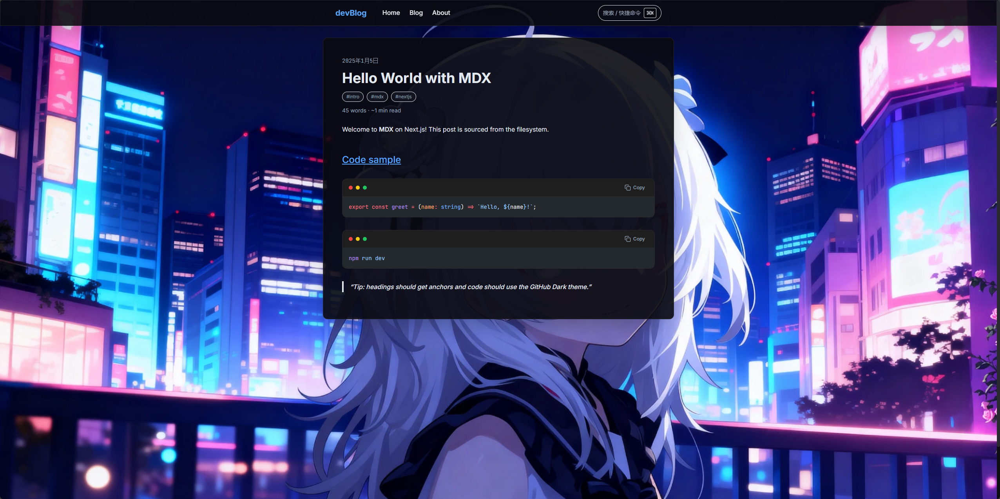
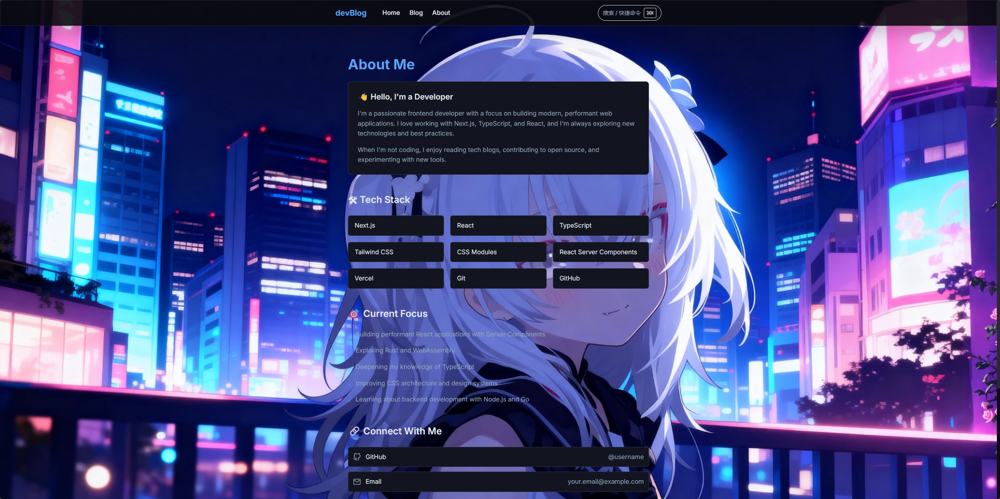

# ByteJournal

<div align="center">


一个由文件系统驱动的 MDX 个人博客/日志站点：基于 Next.js 14 App Router 构建，构建阶段读取 `content/posts` 并静态导出到 `out/`，无需数据库即可部署。

</div>

> 重要：本项目没有浅色/深色主题切换功能，当前为固定深色风格。

## Preview

<div align="center">
  
  <br />
  <br />
  
</div>

<br />

<details>
  <summary>More screenshots</summary>
  <br />
  <div align="center">
    
  </div>
</details>


## ✨ 功能特性

- **MDX 文章系统**：读取 `content/posts/*.mdx`，使用 `gray-matter` 解析 frontmatter，文件名即 `slug`
- **文章列表 / 详情页**：按日期倒序；详情页展示标签、字数统计与预计阅读时长
- **MDX 渲染增强**：`rehype-pretty-code`（GitHub Dark / Shiki）、标题 `slug`、可点击标题锚点
- **全局命令面板**：`Ctrl/Cmd + K` 唤起（导航 + 文章搜索）
- **阅读进度条**：页面顶部实时显示滚动进度
- **图片灯箱**：MDX 图片点击放大预览
- **静态导出部署**：`output: 'export'`，构建产物输出到 `out/`，可部署到任意静态托管

## 🛠️ 技术栈

- Next.js 14（App Router / React Server Components）
- React 18 + TypeScript
- Tailwind CSS + `@tailwindcss/typography`
- MDX：`next-mdx-remote/rsc` + rehype 插件
- 其他：`cmdk`（命令面板）、`date-fns`（日期处理）

## 📁 目录结构

```text
ByteJournal/
├── content/                 # 文章内容
│   └── posts/               # MDX 文章（文件名即 slug）
├── public/                  # 静态资源
│   └── images/
└── src/
    ├── app/                 # Next.js App Router
    │   ├── layout.tsx       # 根布局 / 元信息
    │   ├── page.tsx         # 首页
    │   ├── blog/
    │   │   ├── page.tsx     # 文章列表
    │   │   └── [slug]/page.tsx  # 文章详情
    │   └── about/page.tsx   # 关于页
    ├── components/          # Header/Footer/搜索/灯箱/进度条等
    ├── lib/                 # 读取 MDX、字数/阅读时长、日期等
    └── types/               # 类型定义
```

## 🚀 快速开始

### 环境要求

- Node.js 18+（建议 18.18 / 20+）
- npm（或 pnpm / yarn，自行替换命令）

### 本地开发

```bash
npm install
npm run dev
```

访问 `http://localhost:3000`。

### 构建（静态导出）

```bash
npm run build
```

构建完成后生成 `out/`（静态站点产物）。将 `out/` 部署到任意静态托管即可。

> 提示：静态导出模式通常不使用 `next start`/`npm start` 作为生产运行方式。

## ✍️ 写作指南

在 `content/posts/` 下新建 `.mdx` 文件（文件名即 slug）：

```mdx
---
title: Hello World with MDX
date: 2025-01-05
summary: A quick intro post rendered from the filesystem via MDX.
tags:
  - intro
  - mdx
  - nextjs
---

正文内容...
```

frontmatter 字段（与当前实现一致）：

- 必填：`title`、`date`（缺失或日期不可解析会被忽略）
- 可选：`summary`、`tags`（字符串数组）

访问路径：

- 列表页：`/blog`
- 详情页：`/blog/<slug>`（例如 `hello-world.mdx` → `/blog/hello-world`）

## 🔧 常见定制入口

- 站点元信息（标题/描述等）：`src/app/layout.tsx`
- 首页与关于页文案：`src/app/page.tsx`、`src/app/about/page.tsx`
- 顶部导航站点名/链接：`src/components/Header.tsx`
- 页脚版权与外链：`src/components/Footer.tsx`
- 固定深色风格：`src/components/ThemeProvider.tsx`、`src/app/layout.tsx`（`className="dark"`）

## 📄 License

本项目采用 MIT 许可证，详见 `LICENSE`。
